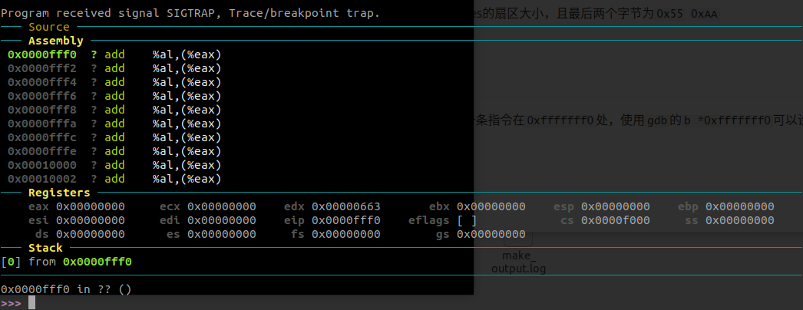
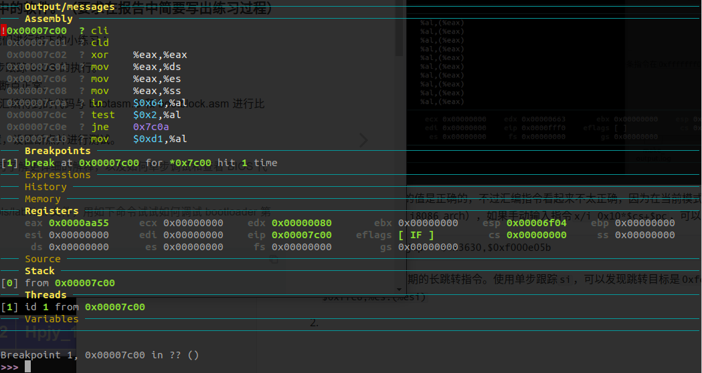
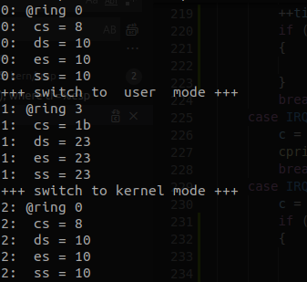
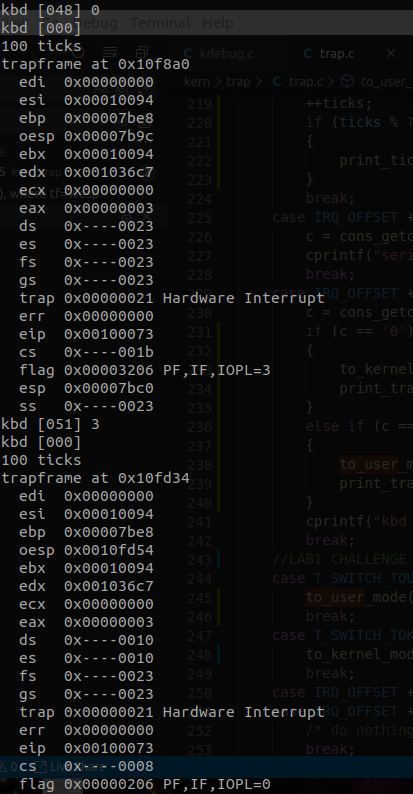

# Lab 1实验报告
计76 张翔 2017011568

## 练习 1
1. 操作系统镜像文件 ucore.img 是如何一步一步生成的？(需要比较详细地解释 Makefile 中每一条相关命令和命令参数的含义，以及说明命令导致的结果)

   使用`make clean && make "V="`可以查看生成时执行的所有命令，整个构建过程可以分为5个阶段。

   **A. 编译内核源码生成obj文件**

   例如下面使用`gcc`编译源码

   ```
   + cc kern/libs/stdio.c
   gcc -Ikern/libs/ -march=i686 -fno-builtin -fno-PIC -Wall -ggdb -m32 -gstabs -nostdinc  -fno-stack-protector -Ilibs/ -Ikern/debug/ -Ikern/driver/ -Ikern/trap/ -Ikern/mm/ -c kern/libs/stdio.c -o obj/kern/libs/stdio.o
   ```

   各个参数的含义：

   `-I`:指定编译时引用的文件目录，用以处理形如`#include "file"`

   `-march`: `gcc`用于`x86`架构的一个选项，用于编译特定架构的代码，如这里是`i686`，生成的代码可能不能运行在比它更老的CPU架构上

   `-fno-builtin` `-nostdinc`:关闭内建库、标准库

   `-fno-PIC`:不生成Position-independent Code，避免Global Offset Table的限制

   `-Wall`:开启所有Warning

   `-ggdb` `-gstabs`:生成GDB和stabs格式的Debug info

   `-m32`:生成32位代码

   `-fno-stack-protector`:关闭栈保护

   `-c`:要编译的文件

   `-o`:输出的obj文件

   **B. 链接obj文件，生成kernel**

   ```
   + ld bin/kernel
   ld -m    elf_i386 -nostdlib -T tools/kernel.ld -o bin/kernel ...
   ```

   各个参数的含义：

   `-m`: 选择emulation格式，这里生成`i386`的ELF

   `-nostdlib`: 关闭标准库

   `-T`: 指定链接器脚本文件

   `-o`: 指定输出的文件

   **C. 编译bootloader**

   ```
   + cc boot/bootasm.S
   gcc -Iboot/ -march=i686 -fno-builtin -fno-PIC -Wall -ggdb -m32 -gstabs -nostdinc  -fno-stack-protector -Ilibs/ -Os -nostdinc -c boot/bootasm.S -o obj/boot/bootasm.o
   ```

   和前面编译内核时所用的命令基本一致，不过多了优化选项`-Os`，表示optimize for size，用以缩小目标代码大小

   **D.链接并生成bootloader**

   ```
   + ld bin/bootblock
   ld -m    elf_i386 -nostdlib -N -e start -Ttext 0x7C00 obj/boot/bootasm.o obj/boot/bootmain.o -o obj/bootblock.o
   ```

   `-N`:设置代码段和数据段均可读写

   `-e`: 设置入口点符号

   `-Ttext`:设置代码段的起始点

   其余参数和链接kernel是一样的

   

   之后使用`objcopy`将链接好的文件生成`bootblock.out`，命令为

   ```
   objcopy -S -O binary bootblock.o bootblock.out
   ```

   `-S`: strip-all，不复制relocation和符号信息

   `-O`: 指定输出目标

   最后使用小工具`sign`检查bootloader的大小是否符合规范，如果不超过510 Bytes，就向最后两字节写入0x55, 0xAA，它们是MBR Signature。

   **E. 生成可启动镜像**

   ```
   dd if=bin/kernel of=bin/ucore.img seek=1 conv=notrunc
   ```

   `if`: Input

   `of`: Output

   `seek`: 开始位置的block，这里是1，就是从512 Bytes（MBR）之后开始

   `conv=notrunc`:不截断`ucore.img` 

2. 一个被系统认为是符合规范的硬盘主引导扇区的特征是什么？

   不超过512 Bytes的扇区大小，且最后两个字节为`0x55` `0xAA`


## 练习 2

1. CPU加电后第一条指令在`0xfffffff0`处，使用`gdb`的`b *0xfffffff0`可以设置断点，如图：

   

   可以看到`cs:eip`的值是正确的，不过汇编指令看起来不太正确，因为在当前模式下`gdb`将`eip`当成了`pc`（而我的`gdb`无法设置`i8086` arch），如果手动输入指令`x/i 0x10*$cs+$pc`，可以得到

   ```
   0xfffffff0:	ljmp   $0x3630,$0xf000e05b
   ```

   可以看到这正是预期的长跳转指令。使用单步跟踪`si`，可以发现跳转目标是`0xfe05b:	cmpw   $0xffc8,%cs:(%esi)`

2. 使用`b *0x700`设置断点，然后`c`执行到断点处，得到

   

   

3. 这里的代码与`bootasm.S`/`bootasm.asm`中的入口点代码是一致的

   ```asm
   # start address should be 0:7c00, in real mode, the beginning address of the running bootloader
   .globl start
   start:
   .code16                                             # Assemble for 16-bit mode
       cli                                             # Disable interrupts
       cld                                             # String operations increment
   
       # Set up the important data segment registers (DS, ES, SS).
       xorw %ax, %ax                                   # Segment number zero
       movw %ax, %ds                                   # -> Data Segment
       movw %ax, %es                                   # -> Extra Segment
       movw %ax, %ss                                   # -> Stack Segment
   ```

   

4. 内核源码中`0x7c2d`处已开启A20，这里是一个跳转至32位保护模式地址空间的指令`0x7c2d:	ljmp   $0xb866,$0x87c32`，在此下断点，然后`si`，跳转到目标地址。


## 练习 3

`boot/bootasm.S`中进入保护模式（并加载启动）的流程如下：

1. 开启A20地址线（在`seta20.1` `seta20.2`中）
   + 等待8042不忙，写P2
   + 等待8042不忙，设置P2的A20位为1
2. 初始化GDT与进入保护模式
   + `lgdt gdtdesc`指令加载4 Byte对齐的GDT，其中有`null seg`,`code seg`,`data seg`
   + 通过将`%cr0`最低位置为1，从而开启保护模式
   + `ljmp $PROT_MODE_CSEG, $protcseg`长跳转进入32 bit模式的代码段，初始化`data segment selector`，清零`%ds,%es,%fs,%gs,%ss`，初始化`%ebp`，设置`%esp`指向`start(0x7c00)`，然后调用`bootmain`

## 练习 4

`boot/bootmain.c`中读取硬盘扇区的步骤：

+ 等待硬盘就绪
+ 发送读取命令（读取的扇区数，LBA命令）
+ 等待硬盘就绪
+ 使用`insl`将硬盘数据取入内存

在`bootmain`中读取了8个扇区（1个4k页）的硬盘数据，之后检查ELF头部是否合法（为`0x464C457F`），如果不合法则直接挂起，否则根据ELF header中的入口数目，将相应的程序段读入指定的内存地址，然后跳转到ELF入口地址`e_entry`，从而完成ELF OS的加载。

## 练习 5

堆栈跟踪的原理是依靠`x86`体系的栈帧结构，在当前函数栈帧的`%ebp`指向位置保存了前一个函数的`%ebp`值，由此可以找出调用链信息，而函数的四个参数存在`%ebp+8`开始的位置，返回地址放在`%ebp+4`，而`%ebp`以下的地址空间可用于存放当前函数的临时变量。因此堆栈跟踪的大致代码如下

```C++
void print_stackframe(void) {
    uint32_t ebp = read_ebp(), eip = read_eip();
    for(uint32_t i = 0; i < STACKFRAME_DEPTH && ebp; ++i) {
        uint32_t *args = (uint32_t*)ebp + 2;
        cprintf("ebp:0x%08x eip:0x%08x args:0x%08x 0x%08x 0x%08x 0x%08x\n", ebp, eip, args[0], args[1], args[2], args[3]);
        print_debuginfo(eip - 1);
        eip = ((uint32_t*)ebp)[1];
        ebp = ((uint32_t*)ebp)[0];
    }
}
```

可以从`qemu`中得到以下输出

```
(THU.CST) os is loading ...

Special kernel symbols:
  entry  0x00100000 (phys)
  etext  0x00103293 (phys)
  edata  0x0010ea16 (phys)
  end    0x0010fd20 (phys)
Kernel executable memory footprint: 64KB
ebp:0x00007b28 eip:0x00100a64 args:0x00010094 0x00010094 0x00007b58 0x00100092
    kern/debug/kdebug.c:305: print_stackframe+22
ebp:0x00007b38 eip:0x00100d39 args:0x00000000 0x00000000 0x00000000 0x00007ba8
    kern/debug/kmonitor.c:125: mon_backtrace+10
ebp:0x00007b58 eip:0x00100092 args:0x00000000 0x00007b80 0xffff0000 0x00007b84
    kern/init/init.c:48: grade_backtrace2+33
ebp:0x00007b78 eip:0x001000bc args:0x00000000 0xffff0000 0x00007ba4 0x00000029
    kern/init/init.c:53: grade_backtrace1+38
ebp:0x00007b98 eip:0x001000db args:0x00000000 0x00100000 0xffff0000 0x0000001d
    kern/init/init.c:58: grade_backtrace0+23
ebp:0x00007bb8 eip:0x00100101 args:0x001032bc 0x001032a0 0x0000130a 0x00000000
    kern/init/init.c:63: grade_backtrace+34
ebp:0x00007be8 eip:0x00100055 args:0x00000000 0x00000000 0x00000000 0x00007c4f
    kern/init/init.c:28: kern_init+84
ebp:0x00007bf8 eip:0x00007d72 args:0xc031fcfa 0xc08ed88e 0x64e4d08e 0xfa7502a8
    <unknow>: -- 0x00007d71 --
++ setup timer interrupts
```

最后一行是`%ebp`为0时调用的函数，它是`bootmain`。`0x00007bf8`是它的栈帧基地址，`0x00007d72`是`bootmain`中ELF校验失败后`bad`标签的位置，而因为`bootmain`无参数，`args`显示的是调用它之前栈上已有的值，实际上它们是`bootblock.asm`的`.code16`标签之后的一小段汇编代码，如`0xc031fcfa`是`cli; cld; xor    %eax,%eax `(小端序)


## 练习 6

1. 从`kern/mm/mmu.h`的`gatedesc`结构体可以看出中断描述符的一个表项大小为`8 Bytes`，其中`gd_ss`是段选择子，`gd_off_15_0`是偏移的低16位，`gd_off_31_16`是偏移的高16位，后二者合成offset+段选择子选择的段的基址可以合成中断处理代码的入口。

2. 基本思路：使用`SETGATE`宏设置256个中断描述符，对于`SYSCALL`，根据提示，它需要`trap`描述符，且权限为用户态。填充完成后可以用`lidt`指令来加载中断描述符表。

3. 大致代码如下：

   ```C++
   ++ticks;
   if(ticks % TICK_NUM == 0) {
       print_ticks();
   }
   break;
   ```

   执行`make qemu`可以看到如下输出

   ```
   ++ setup timer interrupts
   100 ticks
   100 ticks
   100 ticks
   100 ticks
   ```

## Challenge 1

基本思路是利用中断，配合中断处理程序实现处理器状态的切换。因此在`kern/init/init.c`中的切换函数中可以使用汇编`int %code`触发中断。观察`trapentry.S`可知，中断服务程序构造`trapframe`，调用`trap, trap_dispatch`函数进行处理，之后通过`trapframe`恢复寄存器，使用`iret`切换状态。

这里需要注意如果原先处于内核态，产生中断时处理器不会压入`%ss` %`esp`，需要手动预留空间（这也是构造正确的`trapframe`所必须的）

```asm
asm volatile (
    "sub $0x8, %%esp \n" // reserve space for %ss, %esp
    "int %0 \n"
    "movl %%ebp, %%esp \n"
    :
    : "i"(T_SWITCH_TOU)
);
```

`trap_dispatch`被调用时，栈内的状态如下：

|       ... (`trapframe` `tf`)                  |

|          %esp (`&tf`)                            |

|          stack frame of `trap`            |

| stack frame of `trap_dispatch`  |

`trap`返回后，服务程序通过`trapframe`更新寄存器内容，从而实现状态切换。因此，在`trap.c`中，只需要将图中的`&tf`指针替换成用户态`trapframe`，就能切换至用户态，反之同理。切换到用户态的代码如下：

```C++
static void to_user_mode(struct trapframe *tf)
{
    if (trap_in_kernel(tf))
    {
        user_tf = *tf;
        user_tf.tf_cs = USER_CS;
        user_tf.tf_ds = user_tf.tf_es = user_tf.tf_fs = user_tf.tf_gs = user_tf.tf_ss = USER_DS; // create a trapframe in user mode
        user_tf.tf_eflags |= FL_IOPL_MASK; // set proper privlege in user mode
        user_tf.tf_esp = (uint32_t)tf + offsetof(struct trapframe, tf_esp); // setup new %esp
        *((uintptr_t *)tf - 1) = (uint32_t)&user_tf;
    }
}
```

用户态切换至内核态操作类似，但不需要预留`%esp` `%cs`的空间，只需要在IDT中增加一项内容

```C++
SETGATE(idt[T_SWITCH_TOK], 0, GD_KTEXT, __vectors[T_SWITCH_TOK], DPL_USER);
```


## Challenge 2

在`trap.c`处理键盘中断的`IRQ_KBD`处调用Challenge 1的`to_user_mode`或`to_kernel_mode`即可。`trapframe`可以用`print_trapframe`输出，需要注意的是按`3`切换到用户态时，处理程序仍然工作在内核态，需要使用临时变量`user_tf`来输出用户态的`trapframe`。

两个Challenge的总体效果如图所示：





## 总结

#### 与参考答案的对比

总体上思路类似，但实现起来略有不同，如`trapframe`中对于`%esp`的维护，答案中硬编码数字常量`(sizeof(struct trapframe) - 8)`，而我的实现是采用了Linux内核中一个比较常用的宏`offsetof(type, member_name)`，以及答案中似乎没有实现Challenge 2的内容。

#### 重要的知识点

+ CPU的特权模式以及切换、中断的堆栈切换
+ 中断处理过程(x86架构)
+ 段页式内存管理
+ 源代码生成可执行文件的过程
+ 函数调用栈、调用约定

#### 本实验没有对应的知识点

+ 课上提到的RISC-V架构的中断处理方法

