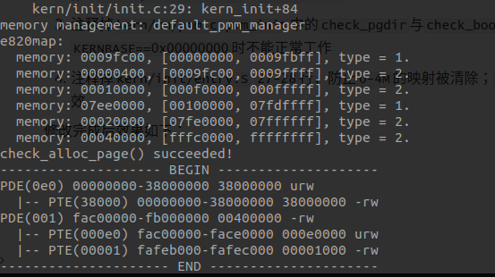

# Lab 2实验报告

计76 张翔 2017011568

## 练习1

### 实现过程

修改`default_alloc_pages`函数，判断分配后是否有剩余页，如果有的话在当前位置后面插入一个property为剩下页数的节点，然后把当前节点从链表中删除；修改`default_free_pages`函数，原先已经实现了相邻块的合并操作，这里只需要把free掉的页面插入到链表中的恰当位置（线性查找），使页地址保持顺序即可。

### 改进空间

现有实现使用链表来维护空闲段，复杂度为$O(n)$，如果换用更高级的数据结构（如线段树），可以支持$O(\log n)$复杂度的查询和修改操作。

## 练习2

### 实现过程

根据注释，先从页目录表中取对应va的pde，如果存在，查询页表返回pte；如果不存在，使用`alloc_page`分配一页用于存放页表，用这个页的地址去填充相应pde即可。

+ PDE与PTE的组成（在`x86`下基本上一致的，不一致的地方用`/`分隔，分别解释）

| 位    | 名称               | 含义                                          |
| ----- | ------------------ | --------------------------------------------- |
| 31-12 | Page Frame Address | PT基址/物理页基址                             |
| 11-9  | Avail              | 供用户程序使用                                |
| 8     | G                  | 忽略/Global位，表示CR3更新时无需刷新TLB       |
| 7     | S                  | 页大小，为0时表示4kB页/PTE中该位为0           |
| 6     | D                  | Dirty位，该页是否被写过                       |
| 5     | A                  | Access位，该页是否访问过                      |
| 4     | PCD                | 1表示不缓存，否则缓存                         |
| 3     | PWT                | 1表示Write Through，0表示Write Back           |
| 2     | U                  | 权限位，0表示仅可内核态访问，否则用户态可访问 |
| 1     | W                  | 页面是否可写                                  |
| 0     | P                  | 页面是否存在                                  |

+ 如果 `ucore` 执行过程中访问内存，出现了页访问异常，请问硬件要做哪些事情？

  CPU会把产生异常的线性地址存储在`CR2`中，在内核栈中保存当前被打断的程序现场，依次压入被打断程序的`EFLAGS,CS,EIP,errorCode`，其中`errorCode`表示页访问异常类型的值。之后CPU把异常中断号`0xE`对应的中断服务程序的地址（通过查询IDT得到）加载到`CS,EIP`中，开始执行中断服务程序。

## 练习3

实现过程翻译注释即可。

+ 数据结构 Page 的全局变量（其实是一个数组）的每一项与页表中的页目录项和页表项有无对应关系？如果有，其对应关系是啥？

  参考`kern/mm/pmm.h`中的`pte2page, pde2page`的实现，可知`PTE`和`PDE`的高20位作为`PPN(Physical Page Number)`，和对应页在`pages`数组内的下标是一致的。

+ 如果希望虚拟地址与物理地址相等，则需要如何修改`lab2`，完成此事？

  1. 修改`kern/mm/memlayout.h`的`KERNBASE`为`0x00000000`
  2. 修改`tools/kernel.ld:10`为`0x00100000`
  3. 注释掉`kern/mm/pmm.c:pmm_init`中的`check_pgdir`与`check_boot_pgdir`，它们包含的一些断言在`KERNBASE==0x00000000`时不能正常工作
  4. 注释掉`kern/init/entry.S` `27-28`行，防止`0-4M`的映射被清除；`58-59`行，此时`page_dir`这一项无效

  修改完成后效果如下：

  

  可以看见此时页表内的恒等映射。

## Challenge 1 - Buddy System

**注：使用`make DEFS=-DUSE_BUDDY_PMM`可以在编译时开启Buddy System的支持。相关代码在`kern/mm/buddy_pmm.c`中**。

Buddy System可以用二叉树来实现，而在二叉树中我们只需要维护孩子节点剩余可分配的页面数，每个节点占用`4B`。设总页面数为$M$，Buddy算法可用的页面数为$a$，那么需要满足$a+a\times 4\text{B}/\text{4kB}\times 2\le M$，这里的系数2是因为满二叉树的总节点数是$2n-1$（$n$个叶子）。

实际实现时，对于二叉树稍作修改，可以让Buddy System支持物理页非2次幂的情形。令逻辑页面数为$a$，如果有$a=2^k$使得上面的式子等号成立，此时可用于分配的页面就是$2^k$；如果等号不成立，那么物理页还有剩余，此时可以令$a=2^{k+1}$，逻辑页面比物理页面多。建树时，从叶节点开始标记，如果逻辑页对应的物理页存在，标记为1，否则为0；维护父节点时，如果两个孩子节点的值相同，父节点的值就是二者相加，否则为二者取max（孩子节点不同时说明子树中存在不对应物理页的逻辑页）。

分配页面时，从树根开始先序遍历直到找到合适的块，分配完成后置标记为0，向上回溯，将沿途父节点的值改成max(left_child, right_child)；释放内存时，通过地址和内存块大小可以计算出树节点的index，然后向上搜索，找到为0的节点，恢复它的标记，向上维护父节点标记即可（这里要考虑相邻空闲块的合并问题，操作方式与建树时是完全相同的，其中parent=left_child+right_child的情况对应一次合并）。

简单说来，这种处理方法就是假装那些不存在物理页的逻辑页已经被分配出去了，且不会被free掉。

显然每次分配/释放页面的复杂度是$O(\log n)$，相比上面用链表实现的First-fit有较大改进，但受限于Buddy System，每次分配的页面数必须是2的整数次幂。

### 测试

见`kern/mm/buddy_pmm.c` 中`117-160`行的代码，测试了分配块的地址关系、分配非2的整数次幂等情形。

### 样例输出

```
e820map:
  memory: 0009fc00, [00000000, 0009fbff], type = 1.
  memory: 00000400, [0009fc00, 0009ffff], type = 2.
  memory: 00010000, [000f0000, 000fffff], type = 2.
  memory: 07ee0000, [00100000, 07fdffff], type = 1.
  memory: 00020000, [07fe0000, 07ffffff], type = 2.
  memory: 00040000, [fffc0000, ffffffff], type = 2.
Buddy init: total: 32290, available: 32226, internal: 64
check_alloc_page() succeeded!
check_pgdir() succeeded!
check_boot_pgdir() succeeded!
-------------------- BEGIN --------------------
PDE(0e0) c0000000-f8000000 38000000 urw
  |-- PTE(38000) c0000000-f8000000 38000000 -rw
PDE(001) fac00000-fb000000 00400000 -rw
  |-- PTE(000e0) faf00000-fafe0000 000e0000 urw
  |-- PTE(00001) fafeb000-fafec000 00001000 -rw
--------------------- END ---------------------
```

可以看到，这种Buddy System的实现方法是可以利用所有页面的，其中64个页面用于存放二叉树的标记数组。

## 总结

+ 与参考答案的区别：大体思路相同，不过练习1的参考答案看起来是将地址在链表中逆序排列的
+ 本实验中重要的知识点，以及与对应的OS原理中的知识点：
  + 连续内存分配算法First-fit
  + x86分页机制
  + 二级页表
  + Buddy System
+ 实验中没有对应的知识点
  + Best-fit, worst-fit
  + 碎片整理

