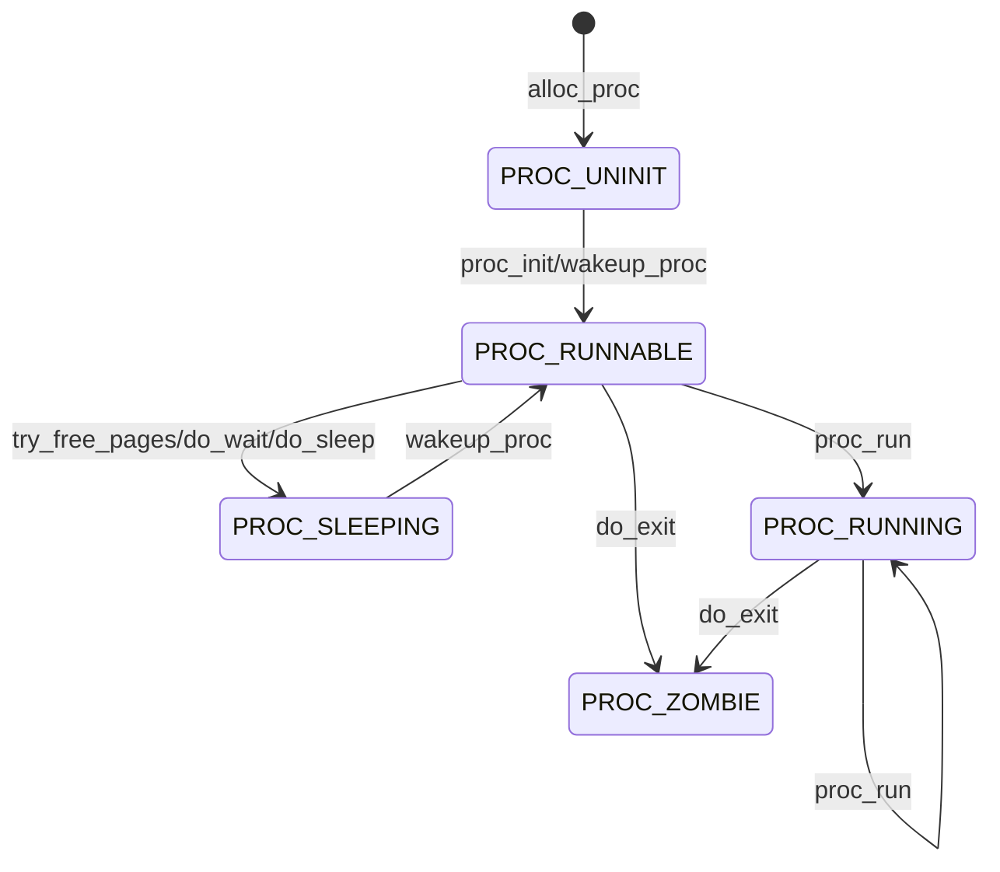

# Lab 5实验报告

计76 张翔 2017011568

## 练习0

+ 根据注释，`alloc_proc`函数需要初始化`wait_state, cptr, yptr, optr`之类的变量，不过在之前的实现中，我直接使用`memset(proc, 0, sizeof(struct proc_struct));`，此处不需要修改
+ `do_fork`时需要在子进程中放入父进程的信息
+ 时钟中断处可以调用`print_ticks`，但需要稍作改变，因为在GRADE模式下该函数会调用`panic`，主动中断当前的运行，会导致`make grade`时诸如`spin`的测例无法通过，只需要`#undef DEBUG_GRADE `即可。

## 练习1

根据注释编写即可，与Lab 1的Challenge类似，将`cs`设置为`USER_CS`，`ds, es, ss`设置为`USER_CS`，`eflags`开启中断，与Lab 1的区别是`esp`需要设置为`USTACKTOP`，而`eip`设置为ELF的入口点。

当用户态进程创建并加载后，CPU让应用程序最终在用户态执行起来的过程如下（参考`proc_run`函数）：

1. 关中断
2. 修改`current`，指向要运行的进程
3. 加载该进程内核栈的`esp`与页目录表地址`cr3`
4. 调用`switch_to`进行上下文切换，这个函数与Lab 4中定义是一样的，它保存`from`进程的上下文，并加载`to`进程的上下文，`ret`后调用`forkret`（因为`copy_thread`中将`eip`设置为`forkret`，而`ret`前将`eip`压入栈顶，则`switch_to`会返回到`forkret`）
5. `forkret`调用`forkrets`，它将栈顶设置为新进程的`trapframe`，跳转`__trapret`，恢复普通寄存器、段寄存器，然后`iret`返回。由于用户进程的段寄存器已经设置为用户态的值，返回时将切换到用户态，并开始执行应用程序的第一条指令。

## 练习2

`copy_range`函数通过PTE获取进程A的`Page`，然后为进程B分配新页，使用`memcpy`复制A的内存到B，直到`start--end`之间的内存被复制完毕。

COW的简要实现：

1. fork进程时，不再直接使用`memcpy`拷贝页，而是直接返回原来的页信息
2. 由于存在页共享，对于共享页，标记为只读
3. 当进程尝试写共享页时，由于已经标记为只读，会触发page fault，在处理函数`do_pagefault`中可以分配新页面，拷贝页面内容，而其余共享该页的进程不受影响

具体实现见Challenge部分

## 练习3

+ fork
  + 检查总进程数目是否达到上限，如果达到上限，则fork失败；
  + 调用`alloc_proc`申请一个初始化后的进程控制块，`setup_kstack`建立内核栈，`copy_mm`拷贝内存空间，`copy_thread`建立trap frame、context，`get_pid`分配PID，`wakeup_proc`置子进程为Runnable，并将子进程加入链表和哈希表。
+ exec
  + 使用`user_mem_check`检查内存是否合法
  + 调用`exit_mmap`与`put_pgdir`释放原来的内存内容
  + 使用`load_icode`从ELF加载进程代码
+ wait
  + 检查保存返回值的`code_store`地址是否合法
  + 根据PID寻找需要等待的子进程，如果没有需要等待的子进程，返回`-E_BAD_PROC`；如果子进程为zombie状态，回收PCB和内核栈，从链表、哈希表中移除该进程；如果子进程非zombie状态，将当前进程置为sleeping状态，待下次被唤醒时再尝试
+ exit
  + 切换到内核态页表，回收当前进程相关的用户虚拟内存空间和对应的内存管理成员变量所占的内核虚拟内存空间
  + 设置当前进程状态为zombie，退出码为error_code
  + 如果父进程正在等待子进程，就唤醒父进程，以帮助子进程完成最后的资源回收
  + 如果当前进程还有子进程，就把这些子进程的父进程置为内核进程`initproc`，如果某个子进程为zombie，则唤醒`initproc`回收之
  + 调用`schedule`切换到新进程


+ 请分析 fork/exec/wait/exit 在实现中是如何影响进程的执行状态的？
  + fork: 仅将子进程的状态由`UNINT`变为`RUNNABLE`，不改变父进程状态
  + exec: 不改变进程状态
  + wait: 如果存在未结束的子进程，当前进程从`RUNNABLE`变为`SLEEPING`，否则不影响状态
  + exit: 进程从`RUNNING`变为`ZOMBIE`
  
+ 请给出 `ucore` 中一个用户态进程的执行状态生命周期图（执行状态，执行状态之间的变换关系，以及产生变换的事件或函数调用）。（字符方式画即可）

  （下面的状态图可以用Typora等支持`mermaid`的编辑器打开查看，在`ucore`代码中，`PROC_RUNNABLE`和`PROC_RUNNING`是同一种状态）



## Challenge

首先将`dup_mmap`中的共享标志设置为1，这个函数在`do_fork`时会调用(`do_fork-->copy_mm-->dup_mmap`)，用以复制父进程的内存到子进程，而`dup_mmap`会调用处理内存复制的函数`copy_range`，需要对它作如下修改

```c++
int copy_range(pde_t *to, pde_t *from, uintptr_t start, uintptr_t end, bool share) {
    ...
	if (share) {
        // share page and make it read only by clearing PTE_W
        page_insert(from, page, start, perm & ~PTE_W);
        page_insert(to, page, start, perm & ~PTE_W);
    } else {
        // copy memory as it is
    }
}
```

这样保证了共享页面的只读性，当某个进程尝试写入被共享的页时，会触发page fault异常，它的处理函数为`do_pgfault`，这种情况的错误代码中`P=1, W/R=1`，因此对处理函数作如下修改，在这种情况下拷贝相应的页：

```c++
int do_pgfault(struct mm_struct *mm, uint32_t error_code, uintptr_t addr) {
    ...
    ptep = get_pte(mm->pgdir, addr, 1);
    ...
    if (*ptep == 0) {
        if(pgdir_alloc_page(mm->pgdir, addr, perm) == NULL) goto failed;          
    }
    else if (error_code & 3 == 3) {
        struct Page *page = pte2page(*ptep);
        struct Page *npage = pgdir_alloc_page(mm->pgdir, addr, perm);
        void *src_kvaddr = page2kva(page);
        void *dst_kvaddr = page2kva(npage);
        memcpy(dst_kvaddr, src_kvaddr, PGSIZE);
    }
    else {
        // do some swap
        ...
    }
}
```

修改完成后，执行`make grade`均能通过所有测例，尤其是`forktree`测例，说明父子进程共享内存正常。由于时间所限，这里没有去模拟Dirty COW。

## 总结

##### 本实验中重要的知识点，以及与对应的OS原理中的知识点

+ 进程状态模型

+ 用户进程
